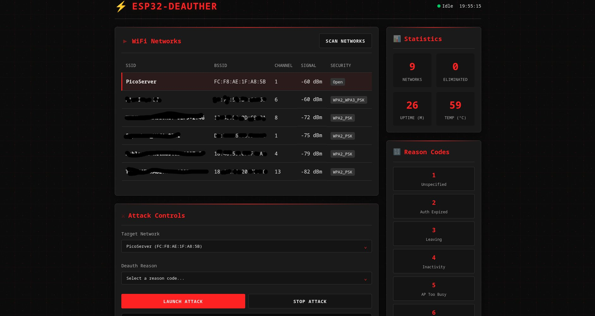

# ESP32-WARMACHINE

ESP32-based WiFi deauthentication tool with web interface. Capable of disconnecting
  2.4GHz WiFi networks using IEEE 802.11 deauth frames. Includes network scanning,
  attack statistics, and modular architecture. Educational/security research use only.

## DISCLAIMER

**This project is made for learning and educational purposes only. I do not accept any responsibility for any trouble, damage, or illegal activities that may result from the use of this software. Users are solely responsible for ensuring their use complies with local laws and regulations.**

## Features

 ### Pros

  - 2.4GHz WiFi Support
  - Modern Web Interface
  - Real-time Network Scanning
  - Multiple Attack Modes
  - Live Statistics
  - Low Cost Hardware
  - Portable
  - Customizable Reason Codes

 ### Cons

  - No 5GHz Support
  - Limited Range
  - No WPA3 Deauth
  - Single Threaded


<!-- <p align="center">
  
</p> -->

  
## Requirements

- **ESP32 Development Board** (ESP32-WROOM-32, ESP32 DevKit v1, etc.)
- **VSCode** (With PlatformIO extension)
- **CP2102 Driver** (Linux already has this driver in its kernel)
## Installation

### Using PlatformIO (Recommended)

1. **Clone the repository:**
   ```bash
   git clone https://github.com/hynryx/ESP32-WARMACHINE.git
   cd ESP32-WARMACHINE
   ```

2. **Open in VSCode (make sure you have been installed PlatformIO extension)**

3. **Upload to ESP32**

##  Usage

1. **Power on the ESP32** - It will create a WiFi Access Point
2. **Connect to the AP:**
   - **SSID:** `ESP32-Warmachine` (default)
   - **Password:** `12345678` (default)
3. **Open web browser** and navigate to: `http://192.168.4.1`
4. **Scan for networks** using the "Scan Networks" button
5. **Select target network** from the list
6. **Choose deauth reason code**
7. **Launch attack** or use "Deauth All" for broader impact

## Configuration

Edit `include/definitions.h` to customize:

```cpp
#define AP_SSID "ESP32-Warmachine"    // Access Point name
#define AP_PASS "12345678"          // Access Point password
#define CHANNEL_MAX 13              // Maximum WiFi channel
// #define LED 2                    // Uncomment to enable LED (if you have one)
// #define SERIAL_DEBUG             // Uncomment for serial output
```

---

**Remember: With great power comes great responsibility. Use this tool ethically and legally.**
